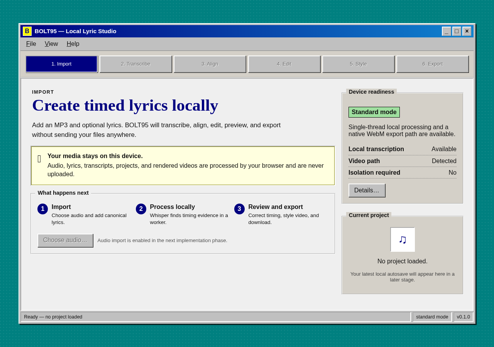

# BOLT95

BOLT95 is a static, local-first lyric timing and lyric-video application. Media,
lyrics, transcripts, projects, and generated output stay in the browser.

The production site is built for <https://seutje.github.io/BOLT95/> and does not require
a server, API, account, runtime secret, or cross-origin isolation.

## User guide



BOLT95 runs entirely in your browser. Audio, lyrics, transcripts, projects, cached
models, background images, and generated exports stay local to the browser profile
you use.

1. Open the app at <https://seutje.github.io/BOLT95/>.
2. In **1. Import**, choose or drop an audio file. Paste lyrics, load a TXT/LRC
   lyrics file, import a saved `.bolt95.json` project, or continue with audio only.
3. In **2. Transcribe**, download or choose the local Whisper model when prompted,
   then run transcription. For test and demo workflows, the deterministic transcript
   option can produce repeatable timing without a model.
4. In **3. Align** and **4. Review**, align the transcript timing to the lyrics and
   inspect warnings or low-confidence lines. Supplied lyrics remain the source text;
   transcription is only used as timing evidence.
5. In **5. Edit**, play and seek the track, adjust line text and start/end times,
   split or merge lines, nudge timings, and use undo/redo while reviewing the
   waveform.
6. In **6. Style**, preview the lyric video, choose square, portrait, or landscape
   presets, adjust the visual theme, and optionally relink a local background image.
7. In **7. Export**, download LRC, enhanced LRC, SRT, WebVTT, or project JSON. On
   supported Chromium browsers, you can also export a WebM or MP4 lyric video.

Use **File**, **View**, and **Help** for privacy notes, browser capability details,
safe diagnostics, project recovery, and clearing local data. Project JSON files do
not contain audio bytes, so reopening a project may ask you to relink the original
audio file.

## Development

Requirements: Node.js 24, npm, Docker, and a current Chromium browser.

```sh
npm ci
npm run dev
```

The development server listens on <http://127.0.0.1:8000>.

## Quality gates

```sh
npm run format:check
npm run lint
npm run typecheck
npm run unit
npm run test:e2e
npm run build
npm run release:check
```

Browser tests run against both `/` and `/BOLT95/`. Generated Whisper models, WASM,
fixtures, browser artifacts, and production builds are intentionally not committed.

See [PLAN.md](PLAN.md), [DESIGN.md](DESIGN.md), and
[docs/compatibility.md](docs/compatibility.md) for implementation and compatibility
details. Release privacy, limits, and production smoke evidence are documented in
[docs/privacy.md](docs/privacy.md), [docs/limits.md](docs/limits.md), and
[docs/release/phase11-evidence.md](docs/release/phase11-evidence.md).
